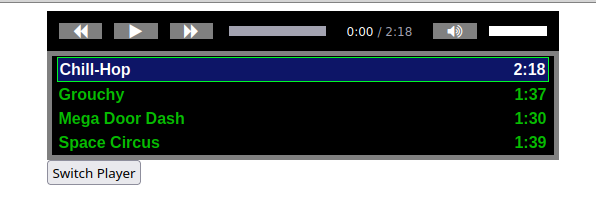

# HTML5 Audio Player & Playlist
A __CSS__ styled __HTML5__ audio player and playlist controlled by __JavaScript__



See a live example https://sitaber.github.io/audioplaylist


## Setup
To make your own playlist, find the following section in `index.html`

```HTML
<!-- Playlists !-->
<div class="playlist active" id="one"> 
<a class="playlist-item active" href="./songs/Chill-Hop.mp3">Chill-Hop <span> 2:18 </span></a>
<a class="playlist-item" href="./songs/Grouchy.mp3">Grouchy <span> 1:37 </span></a>   
<a class="playlist-item" href="./songs/Mega Door Dash.mp3">Mega Door Dash <span> 1:30 </span></a>
<a class="playlist-item" href="./songs/Space Circus.mp3">Space Circus <span> 1:39 </span></a>  
</div> 
```

You always need the first 2 items, the __div__ element and an __a__ element with ```class="playlist-item active"```
```HTML
<div class="playlist active" id="one"> 
<a class="playlist-item active" href="{path-to-song}">{Song Name} <span> {length} </span></a>
```
Where 
- {path-to-song} is the relative or absolute path to a local song file, or external link
- {Song Name} is the name you want displayed in the play list
- {length} is the length of the song that will be displayed

For each playlist item, add the following anchor HTML element
```HTML
<a class="playlist-item" href="{path-to-song}">{Song Name} <span> {length} </span></a>
```
and fill in the fields as appropriate. 

**NOTE:** You do not need the _songs_ folder. You can have the song file be in any location you would like

## Player
The styled player should work with most web browsers. However, if it is unresponsive or not functioning correctly, click the button below the playlist labeled `Switch Player` to switch to your browsers default player.

If you do not wish to use the player, remove everything between the comments:

`<!-- Main Control Bar !-->` and `<!-- End Main Control Bar !-->`

And remove the following at the bottom of `index.html`
```HTML
<div>         
<button type="button" id="btn">Switch Player</button>
</div> 
```
