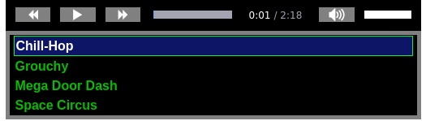

# HTML5 Audio Player & Playlist

A __CSS__ styled __HTML5__ audio player and playlist with  __JavaScript__ controls. All styles are CSS with the help of some icons for the player buttons. All needed styling and JavaScript files are provided in the `assets` directory. See the screenshot below for what the player and playlist look like, and see a live example here: https://sitaber.github.io/audioplaylist



The primary use case for this project is deployment on GitHub pages (or other static sites) where one would like to have a media player with more than one song available and not have several HTML audio players.

You can use this project as a stand alone web page with just `index.html`, or use `audioPlayer.html`, which can be treated as a "component", and deploy that with a template engine or some other automated means of generating a web page (e.g. Jekyll, Jinja, Django etc.).

All the CSS file use `class` and `id` attribute that should not conflict with other custom styles, and they only apply to elements in the `player-container`.

## Setup
To make your own playlist, find the following section in `index.html` and modify to your needs. This can be done manually, with JavaScript, server side code, or with a template engine/system.

```HTML
<!-- Playlists !-->
<div id="playlist">
  <a class="playlist-item active" href="./songs/Chill-Hop.mp3">Chill-Hop</a>
  <a class="playlist-item" href="./songs/Grouchy.mp3">Grouchy</a>   
  <a class="playlist-item" href="./songs/Mega Door Dash.mp3">Mega Door Dash</a>
  <a class="playlist-item" href="./songs/Space Circus.mp3">Space Circus</a>  
</div>
```
You can add or remove as many _<a>_ elements as you need, as long as they follow the convention:

```HTML
<a class="playlist-item" href="{path-to-song}">{Song Name}</a>
```

Where
- {path-to-song} is the relative or absolute path to a local song file, or external link
- {Song Name} is the name you want displayed in the play list

Use ```class="playlist-item active"``` on the anchor you want to be 'active', typically the first item in the list.

**NOTE:** You do not need the _songs_ folder contained in this repo. You can have the song files be in any location you would like, either local or external.

## Player
The styled player should work with most web browsers. However, if it is unresponsive or not functioning correctly, remove everything between the following comments in `index.html`

`<!-- Main Control Bar !-->` and `<!-- End Main Control Bar !-->`
